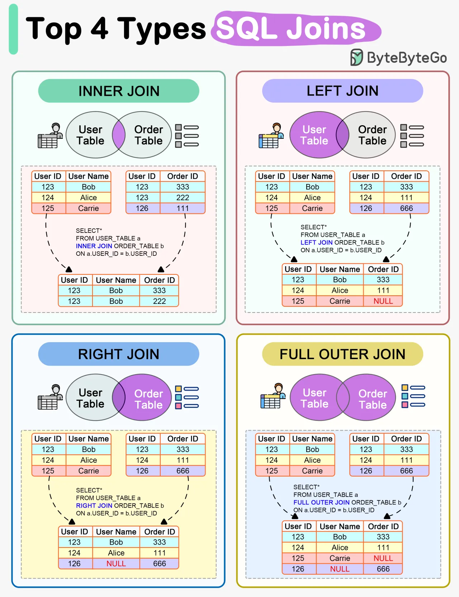

# JOINS

- Inner Join : Returns matching rows in both tables.
- Left Join : Returns all records from the left table, and the matching records from the right table.
- Right Join : Returns all records from the right table, and the matching records from the left table.
- Full Outer Join : Returns all records where there is a match in either left or right table.
- Cross Join : Returns the Cartesian product of the two tables.
- Self Join : It's regular join but the table is joined with itself.

