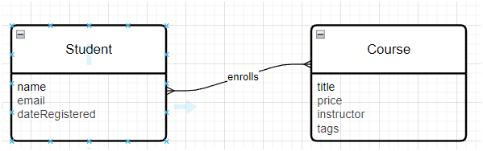
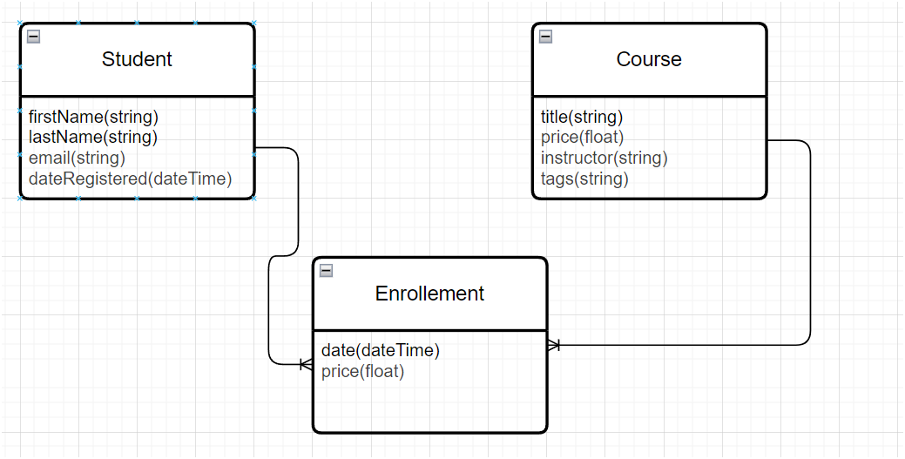

# 1. Data Modeling

##### 1.1 Steps

- Understand the requirements ( Collect info from form, talk to relevent stack holder etc.)
- Build a conceptual model ( It's relation diagram, where we specify table and interactivity )
- Build a logical model ( same as Conceptual but in more detail)
- Build a pyhysical Model ( Implementation of logical model for the specific DB technology eg. MySQL )

##### 1.2 Conceptual Model

- Represents the entities and their relationships.
- Two ways we can represent them (1. Entity Relationship(ER)  2. UML ), for data modeling ER is most suited.
- Tools : Microsoft Visio, Draw.io, LucidCharts

  
- This is conceptual model(we did not specified type of each attribute).
- And we read left to right, Student  "enrolls" Course (It's many to many relationship).

##### 1.3 Logical Model

- These models are in very detail, detailed so much that they are actually end up being the table in data base.
- Relationships

  - one to one
  - one to many
  - many to many
  - And othere are just variations of above 3.

  
- In this diagram see we specified the data type ( but we did only generic ones not the specific ones like varchar etc. That's why it's called logical)
- And we created another table to store the student and course relationships.

##### 1.4 Physical Model

- It's implementation of logical model for specific DB technology.
- Keys : Primary Key( Single or Composite) , Foreign Key (single or Composite)
- **Note : Always remember when we use primary key as foreing key in another table the data of primary key inserted in that table, and if we choose field which is bigger in size, our db will end up taking too much of space. And this is valid for scenario where we choose the composite primary key, in that all composite fields will be repeated**
- Foreign Key Contraints : These are essential, which specify what should we do with foreign key if primary key changes in parent table.(Rule of thumb, our db must be designed such way there is no need to change the PK)
  - Cascasde : Meas update this also
  - No-Action/Restrict  : Do nothing
  - SET NULL

## Normalization

- This is very essential to design the optimal database.
- There are 7 normal forms, but in 99.99% scenario only first 3 are enough.
- Rule to follow : use common sense and remove the redundancy , and declare the attributes where they belongs to. eg. payment_amount, should not be part of customer table.

## Link Table

- In Relation database, we can't create many to many relation ship. We just have one to many and many to one.
- So for that we have to create one table called `Link Table` and create two one to many etc.
- Eg. Tags, we have table where it's used (Course table) and another table where it's stored(Tags table), and needed one Link Table (Course Tags) to create that many to many relation ship.

## Terms Related 

- Forward Engineering : This is feature on MySQL workbench which help to convert logical schema to database.
- Synchronization : This is way to make changes in our table, first we update in ER diagram then synchronize.
- Reverse Engineering : This feature used to create ER diagram of database which does not have ER diagram and then we can potentially fix the issues related to the database.
